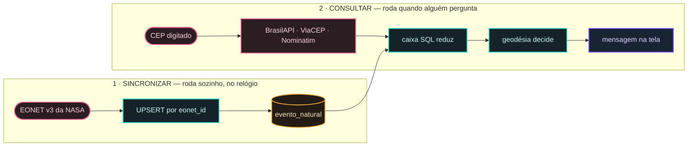

# Visão geral

Este sistema avisa pessoas quando um desastre natural acontece **perto de um endereço
delas**. Ele lê os eventos que a NASA publica, compara com os endereços cadastrados, e
registra um aviso para cada pessoa em risco.

É uma reconstrução completa de um projeto acadêmico de 2025, que era Next.js + Spring Boot
+ Oracle. A reconstrução é Java 25 com Quarkus, Qute e HTMX — **sem Node**.

## O caminho de um alerta, do começo ao fim

São **dois caminhos independentes** que se encontram numa tabela. O de cima roda sozinho, no
relógio; o de baixo roda quando alguém pergunta.

1. **Sincronizar.** O sistema busca eventos na EONET v3 da NASA e grava na base local. A
   operação é **segura de repetir**: o mesmo evento não entra duas vezes, e a posição dele é
   atualizada a cada sincronização. É a única coisa que este sistema escreve no banco.
2. **Localizar.** A pessoa informa um CEP, que vira coordenada por uma cadeia de provedores:
   BrasilAPI, ViaCEP e, quando nenhum dos dois traz posição, Nominatim sobre o endereço
   textual. **CEP que não resolve é 404 com a explicação** — nunca uma lista vazia, que
   afirmaria "não há desastre perto" quando o que houve foi não saber onde é.
3. **Comparar, em dois estágios.** Um `WHERE` retangular reduz os candidatos usando o índice;
   a distância geodésica sobre a esfera decide quem entra. Os dois são necessários, e o
   porquê está no diagrama de [Alerta](/documentacao/fatia-alerta).
4. **Mostrar.** A mensagem é montada e exibida. **Nada é gravado** — nem o e-mail, nem o CEP,
   nem a consulta.

Não há passo 5. Havia: uma fila em padrão outbox, com estados `PENDENTE`, `ENVIADO` e
`FALHOU`, e uma tela de auditoria de despacho. Saiu inteira, e o motivo está em
[Sem cadastro](/documentacao/sem-cadastro).

## O que este sistema garante

- **O mesmo evento não avisa a mesma pessoa duas vezes.** A chave de idempotência é
  `(cliente, evento)` e mora no banco — não na memória de um processo que reinicia. Uma
  tempestade que dura cinco dias aparece em cinco varreduras.
- **Toda ausência é declarada.** Endereço sem coordenada, evento sem posição, contato que
  não recebe alerta — todos aparecem na tela dizendo por que não participam. No projeto
  original, esse silêncio era total, e a descoberta viria no dia do evento.
- **Nenhuma fonte de dados exige chave de API.** NASA, BrasilAPI, ViaCEP, Nominatim e
  GDACS são todas abertas. Não há credencial de terceiro que possa vazar.
- **Tudo em UTC.** O relógio, o log, o banco e a tela. Um alerta que erra o fuso erra
  justamente na virada do dia — que é quando a janela de risco muda de resposta.

## O que este sistema NÃO faz hoje

- **Não envia e-mail.** Não há servidor SMTP configurado. O adaptador em uso **registra no
  log** e não entrega a ninguém. A tela diz isso em voz alta, ao lado de cada aviso
  marcado como "Enviado" — porque a única coisa pior que não ter alerta é acreditar que
  se tem.
- **Não tem autenticação.** Está no escopo, ainda não construído.

## Por onde continuar

- [Arquitetura](01-arquitetura.md) — como o código está organizado, e a guarda que
  impede o acoplamento.
- [Defeitos medidos](30-defeitos-medidos.md) — os enganos do projeto original, cada um
  com o número que o torna real.
