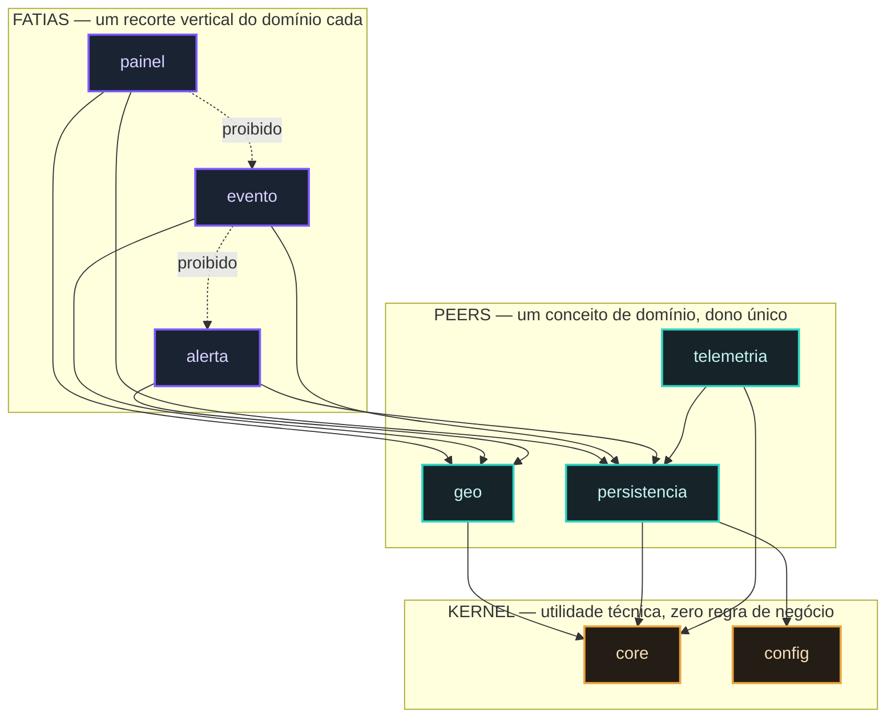
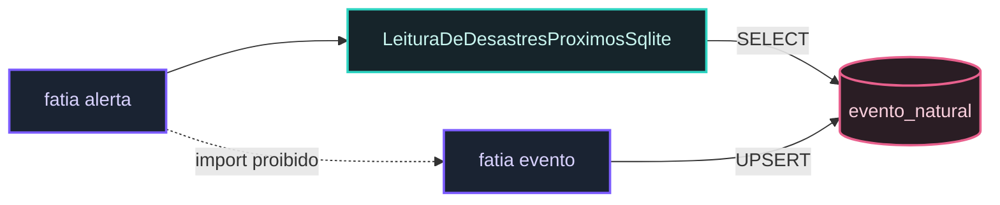

# Arquitetura

O código é organizado em **fatias verticais**, apoiadas em **peers** compartilhados e um
**kernel** técnico. A regra que sustenta tudo é curta:

> A seta aponta sempre `fatia → peer → kernel`. Nunca ao contrário, nunca lateral entre
> fatias.

## O desenho

As setas pontilhadas são as que **não existem** e nunca podem existir: a allowlist de
fatia-conhece-fatia é **vazia**, e a guarda recusa passar por vacuidade.

## As três categorias

| categoria | o que é | quem pode depender dela |
|---|---|---|
| **kernel** (`core`, `config`) | utilidade técnica transversal, zero regra de negócio | qualquer um |
| **peer** (`geo`, `persistencia`, `telemetria`) | um conceito de domínio com dono único | qualquer fatia |
| **fatia** (`painel`, `evento`, `alerta`) | um recorte vertical completo | ninguém |

Cada fatia tem `domain`, `application`, `infrastructure` e `presentation` próprios.

**Eram seis fatias.** `cliente`, `contato` e `endereco` viraram `inscrito`, que depois saiu
inteira — o sistema deixou de guardar gente. Os números e o motivo estão em
[Sem cadastro](/documentacao/sem-cadastro).

### Como uma fatia usa dado de outra sem conhecê-la

A resposta é o **modelo de leitura**: a fatia escreve SQL sobre o esquema compartilhado, em
vez de importar a classe da vizinha.

**O esquema é contrato; a classe da vizinha não é.** As duas fatias combinam pelo nome da
coluna, que uma migração versionada muda de forma controlada — e não por um `import`, que
faria a mudança de um campo interno de `evento` quebrar a compilação de `alerta`.

## A guarda que torna isso real

A regra não é uma convenção escrita: é um **teste que reprova o build**. Sete regras
executáveis, em `FronteiraArquiteturaTest`:

0. o alvo não está vazio — sem isto, todas as regras passariam por vacuidade;
0-bis. todo módulo de topo tem categoria declarada;
1. o kernel não conhece peer nem fatia;
2. peer não conhece fatia;
3. **fatia não conhece fatia** — lista de exceções vazia;
4. `..domain..` é puro: nenhum framework atravessa;
5. `..application..` não depende de `..infrastructure..`.

Elas **já reprovaram o build** duas vezes durante a construção, e nas duas estavam certas.

### Quando a regra 3 apertou, e o que ela ensinou

A fatia `alerta` precisa de dados de `cliente`, `endereco`, `contato` e `evento`. Importar
qualquer um deles reprovaria o build.

A saída não foi afrouxar a regra. Foi notar que `alerta` não precisa das **classes** das
outras fatias — precisa de uma **resposta**. Ela tem o próprio modelo de leitura, com SQL
sobre o esquema, que pertence ao peer `persistencia`. Nenhum import cruza fatia.

O ganho não é burocrático: se o cadastro de cliente mudar de forma amanhã, o alerta
continua compilando, e o que muda é uma consulta — não uma cascata por quatro fatias.

### E quando a tela precisou cruzar

O formulário de cliente deveria oferecer o CEP com preenchimento automático, que é da
fatia `endereco`. Mesma regra, mesmo impedimento.

A solução: **o HTMX cruza no nível HTTP**. A tela de endereço vive na fatia dela, a tela
de cliente aponta para lá com um link, o navegador faz a chamada — e em Java as duas
fatias continuam sem se conhecer.

## As outras guardas

Além da fronteira, o build carrega guardas que reprovam:

- **exceção específica por classe** — nenhuma classe lança exceção genérica;
- **UTC no sistema inteiro** — só uma classe pode ler o relógio do sistema;
- **todas as telas renderizam** — inclusive os ramos que só aparecem com dados;
- **segredos e caminhos proibidos** — antes de cada commit.

Detalhes em [Guardas executáveis](21-guardas.md).
