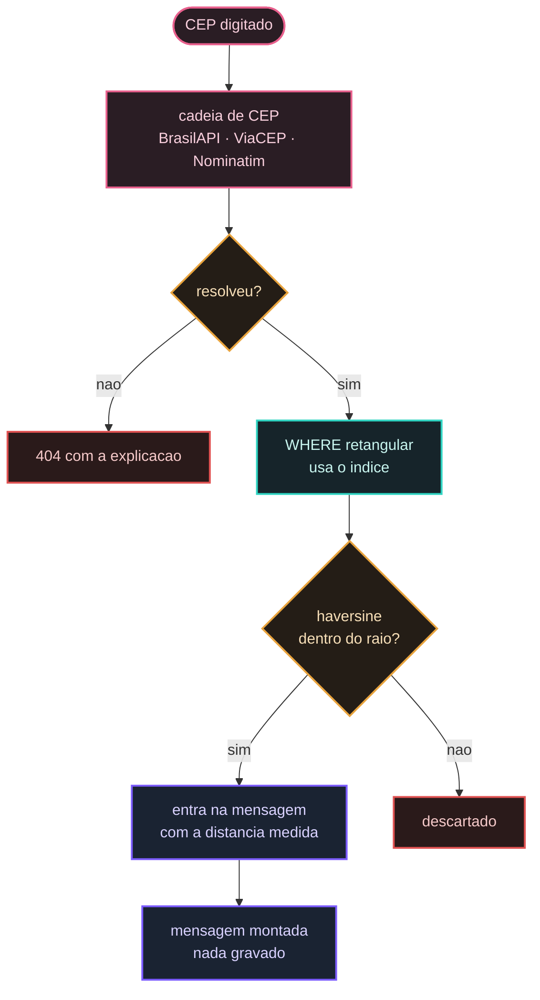
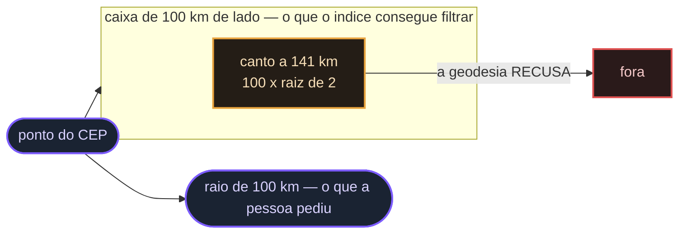

# Fatia `alerta`

A saída de todo o sistema. A sincronização, a geodésia e o esquema do banco existem para
produzir a resposta de uma pergunta só: **"tem desastre perto de onde eu estou?"**.

## Ela não guarda nada — e isso é o desenho, não uma limitação

A pessoa informa um CEP, opcionalmente um e-mail, e recebe na tela a mensagem de alerta que
lhe seria enviada. **Nada é gravado**: nem o e-mail, nem o CEP, nem a consulta.

Isto substituiu um sistema que gravava. Havia tabela de inscritos, fila de envio em padrão
outbox e uma tela de auditoria de despachos. O motivo da remoção está em
[Sem cadastro](/documentacao/sem-cadastro), e o resumo é: uma lista de e-mails é um alvo,
dado pessoal traz obrigação legal que uma vitrine não tem por que assumir, e formulário
público que escreve no banco é abusado.

O ganho de engenharia veio de graça: sem estado, não há o que reconciliar quando o processo
cai no meio. As perguntas que o padrão outbox existia para responder — *avisou duas vezes?
ficou pendente para sempre? a fila parou?* — deixaram de ser fazíveis.

## O caminho da resposta

1. **O CEP vira coordenada.** BrasilAPI primeiro, ViaCEP e Nominatim como alternativas.
   CEP que não resolve é **404 com a explicação** — nunca uma lista vazia, que afirmaria
   *"não há desastre perto"* quando o que houve foi **não saber onde é**.
2. **A caixa reduz.** Um `WHERE` retangular sobre latitude e longitude, que o índice do
   banco consegue usar.
3. **A geodésia decide.** Haversine sobre os candidatos que sobraram.

O passo 3 é o que o projeto original não tinha, e é o defeito de 456 km descrito em
[Defeitos medidos](/documentacao/defeitos).



### Por que a caixa e a geodésia, e não só uma das duas

O canto da caixa é o problema, e ele se desenha:



Só geodésia obrigaria a calcular a distância de **todos** os eventos da base a cada consulta.
Só caixa alertaria quem está no canto dela: **o canto de uma caixa de 100 km fica a 141 km**
do centro, porque a diagonal do quadrado é o lado vezes `√2`.

A caixa é deliberadamente **maior** que o raio pedido, por esse mesmo fator — se fosse do
tamanho do raio, ela recortaria eventos que a geodésia aceitaria.

### Prova

`FluxoDeAlertaTest` insere dois eventos e pergunta ao modelo de leitura:

```
evento em cima do ponto        (0 km)    -> entra na mensagem
evento a 440 km, raio 100 km             -> NAO entra
o mesmo evento, raio 500 km              -> entra
distancia devolvida para ele             -> ~440 km, medida
```

A terceira linha é o **controle positivo**, e sem ela as duas primeiras não provam nada: uma
leitura que não devolvesse resultado algum passaria no caso do "não entra" e o teste diria
que a geodésia funciona.

## INV-ALERTA-001 — a distância na mensagem é a geodésica

**O número que aparece ao lado de cada desastre é medido sobre a curvatura da Terra**, nunca
a distância da caixa que o índice usou.

- **Dano se quebrado:** a pessoa lê "a 90 km" sobre um evento que está a 130 km e decide com
  base nisso. O alerta passa a ser pior que a ausência dele, porque é confiável na aparência.
- **Camadas que protegem:** a caixa não chega à saída — ela só existe dentro do SQL; o
  `record DesastreProximo` só é construído depois do cálculo geodésico.
- **Teste que comprova:** `aDistanciaEhGeodesica`, com tolerância larga de propósito — o que
  se prova ali é que a distância é **medida**, não a precisão da fórmula, que o teste da
  geodésia cobre com pares conhecidos.

## INV-ALERTA-002 — o e-mail nunca é registrado

O endereço entra, é usado para montar a saudação da mensagem, e **não vai para o log, não
volta na resposta e não toca o banco**.

- **A API é `POST` mesmo sem escrever nada.** Num `GET` o e-mail iria na URL — que fica no
  log de acesso do servidor, no histórico do navegador e no cabeçalho `Referer`. Três lugares
  onde um endereço de e-mail não deveria estar. *Idempotência não é o critério aqui; onde o
  dado sensível trafega é.*
- **A resposta não ecoa o e-mail recebido.** Devolvê-lo o faria aparecer no log de quem
  chamou, e quem chamou já o tem.
- **O CEP, sim, é registrado.** Ele identifica uma região, não uma pessoa, e sem ele não há
  como diagnosticar "por que o alerta desta área veio vazio".
- **`guardado: false` está no contrato da resposta**, de propósito: quem integra precisa
  poder afirmar, pelo próprio contrato, que nada foi persistido.

## Não há servidor de e-mail, e a tela diz isso

O sistema **monta** a mensagem e a **mostra**. Não existe adaptador de envio, e é por isso
que não existe: um adaptador que registrasse sucesso sem entregar seria **pior que não ter
alerta nenhum** — a tela mostraria cobertura que não existe, e a descoberta viria no dia do
desastre.

Como nada é gravado nem enviado, não há o que mascarar num log nem tela de auditoria de
despacho. O que sobrou é a mensagem na tela, para a pessoa que a pediu.

## Como esta fatia fala com as outras sem conhecê-las

Ela **não importa** nenhuma classe de `evento` nem de `painel`. Tem o próprio **modelo de
leitura**, com SQL sobre o esquema compartilhado — o esquema é contrato, a fatia vizinha não
é. A regra 3 da guarda de fronteira é a prova, e a allowlist de fatia-conhece-fatia é
**vazia**.

Para geodésia e coordenada ela usa o *peer* `geo`; para conexão, o *peer* `persistencia`.
*Peer* pode ser conhecido por qualquer fatia — é o que o distingue de uma fatia.
